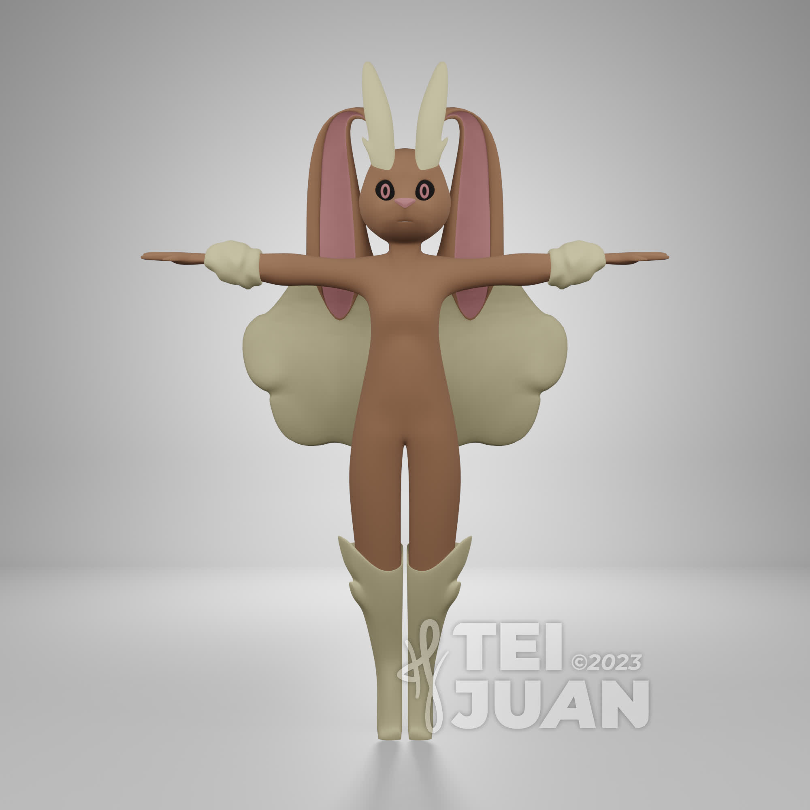
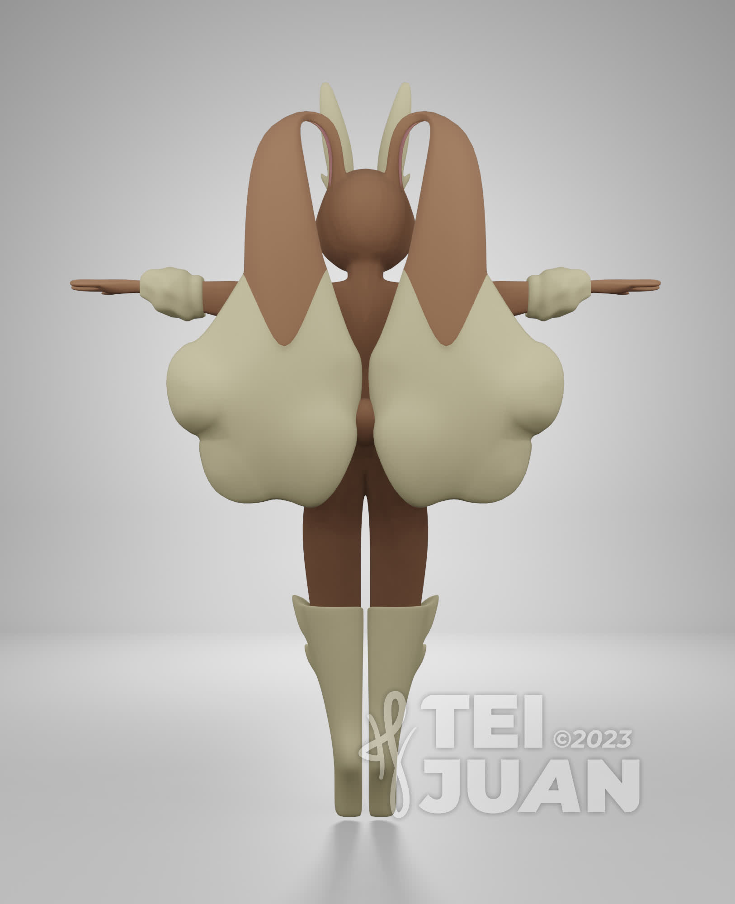
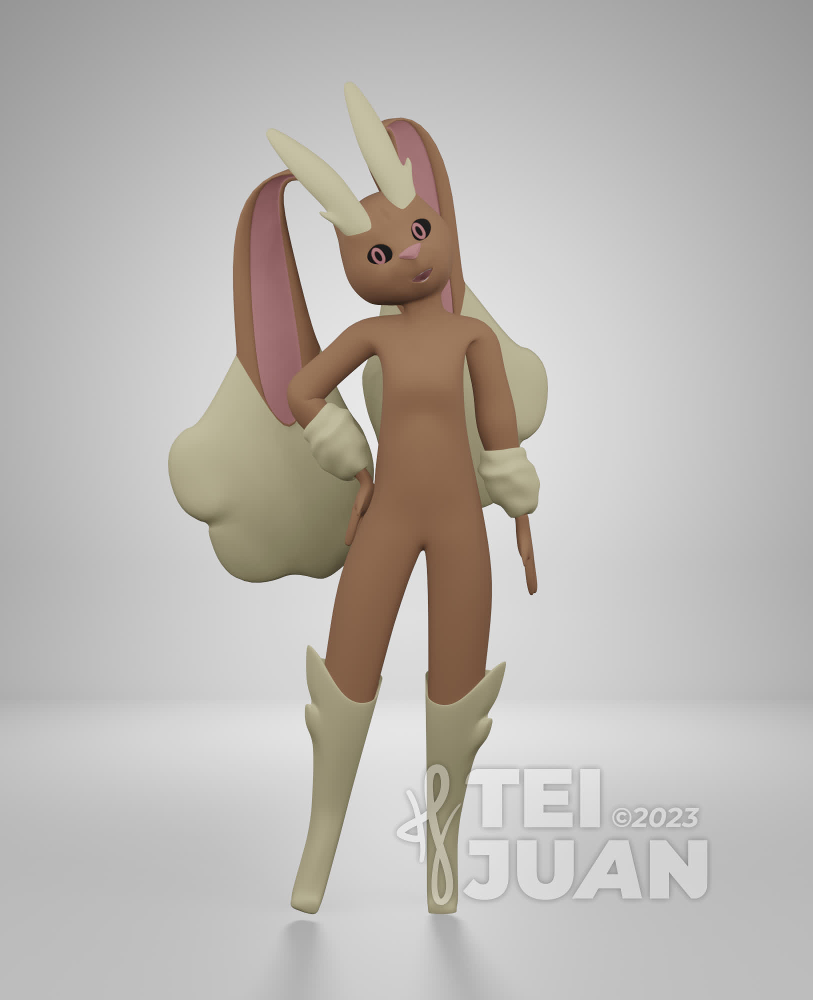

---
#TMPL20230005
title: "Lopunny"
date: 2023-09-18 07:30:00 -0300
author: teijuan
excerpt: ""
categories: pokemon

tags: bunny, pokemon, lopunny
---

I'm so glad to present one of my first 3d models, a pokemon Lopunny.
It has a full body rig and a few face movable parts.
The mesh is kinda irregular at some parts and the colors has a generic texture, but overall I see a huge progress since I've started learning 3D modeling and animation, which was in late june.
As always, tips and feedbacks are very appreciated. I'm willing to sell this kind of job, so I'd love to receive ideas about services to offer and how to offer as well.

  
  
  
  
  
  

Just a shape key test...

  

Lopunny © Pokémon